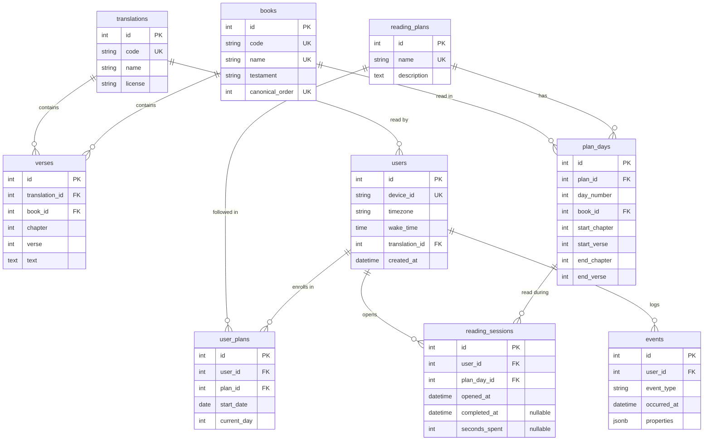

# Morning Manna – Entity Relationship Diagram

How the nine tables connect. Source of truth: `backend/app/models.py`.

## Unique rules

Mermaid can only mark single columns as `UK`. These rules span several columns:

| Table | Unique together | Meaning |
|---|---|---|
| `verses` | `translation_id, book_id, chapter, verse` | Each verse appears once per translation |
| `plan_days` | `plan_id, day_number` | Each plan has one row per day |
| `user_plans` | `user_id, plan_id` | A reader joins each plan only once |
